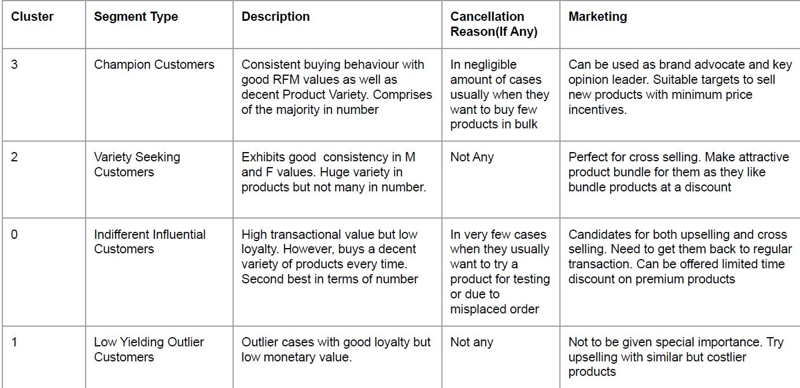
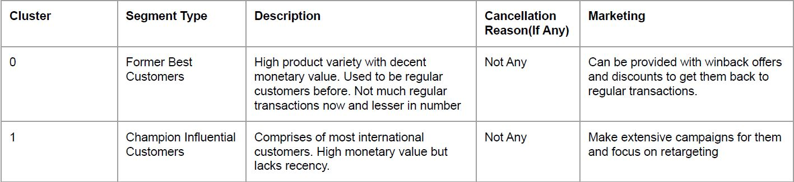

# ML Model for Customer Segmentation and Effective Cross-Selling

<b>Proposed Algorithm to perform the objectives: K Prototype Clustering</b>

The steps in the life cycle of this data science project is as follows:
1. EDA (Exploratory Data Analysis)
2. Data Preprocessing
3. ML Model Blueprint

This repository contains a detailed explanation of all the three parts with codes.

<b>Analysis of Domestic Customer Segments</b>

<b>Analysis of International Customer Segments</b>

